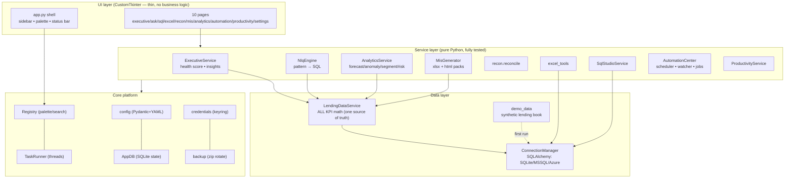

# FinSight Architecture

## Layer diagram



## The rules that keep it maintainable

1. **UI imports services; services never import UI.** Every module works headless — that is
   what `finsight --selftest` and the 62 tests exercise, and why CI can run without a display.
2. **One source of truth for numbers.** All KPI math lives in `LendingDataService`. Executive,
   MIS, NLQ, and Analytics all call it — the dashboard and the board pack can never disagree.
3. **Dependency injection at one composition root.** `ui/context.py::build_context()` wires
   config → appdb → connections → services and hands pages a single `AppContext`. Tests build
   the same graph against a temp database.
4. **The Tk thread only draws.** Anything touching disk/DB/network goes through `TaskRunner`
   (thread pool) and returns via `widget.after()` marshalling — the UI cannot freeze.
5. **Fail loudly, degrade gracefully.** Domain errors carry messages the status bar can show;
   the automation loop survives job failures (and logs them); missing keyring degrades to
   session-only secrets with a visible warning.

## Canonical lending schema

Executive/NLQ/Analytics read these shapes (the demo generator creates them; map your
warehouse with views of the same names/columns):

```
branches(id, name, city, region, opened_on)
officers(id, branch_id, name, role)
loans(id, branch_id, officer_id, customer_name, product, principal,
      interest_rate, tenure_months, emi, disbursed_on, status['active'|'closed'|'npa'])
payments(id, loan_id, due_date, amount_due, paid_date NULL, amount_paid, mode)
collection_targets(branch_id, month 'YYYY-MM', target_amount)
```

Definitions: an installment is **overdue** when `due_date < today` and `amount_paid <
amount_due`; **DPD** = days past due of that installment; **PAR%** = overdue unpaid /
portfolio outstanding; **efficiency** = collected MTD / due MTD.

## Concurrency model

- UI work: `TaskRunner` (4 worker threads) + `after()` callbacks.
- Automation: one daemon thread ticking every `poll_seconds`; schedules computed from
  `last_run`, watcher diffs directory snapshots; both survive exceptions.
- SQLite app-state: single shared connection guarded by a lock, WAL mode.
- SQL queries: SQLAlchemy engines with `pool_pre_ping`; results capped by `max_rows`.

## Storage & security

Everything user-generated lives in `%LOCALAPPDATA%\FinSight` (override with `FINSIGHT_HOME`):
`finsight.db` (state), `demo_lending.db`, `config.yaml`, `reports/`, `logs/`, `backups/`.
Secrets (DB passwords, SMTP) go through `keyring` → Windows Credential Manager; if no keyring
backend exists they are kept in memory for the session only — never written to disk.

## Extension points

- **New automation job**: `context.automation.register_job("name", callable)` — it instantly
  appears in Run-now, schedules, and watches, with logging for free.
- **New NLQ intent**: add a `_try_*` handler in `nlq.py` and register it in `ask()`.
- **New page**: create `ui/pages/foo_page.py`, add to `PAGE_FACTORIES` and `_PAGES` — the
  sidebar, palette, and search pick it up automatically.
- **Different warehouse**: implement views matching the canonical schema, or extend
  `ConnectionManager` with a new URL builder (one function).
